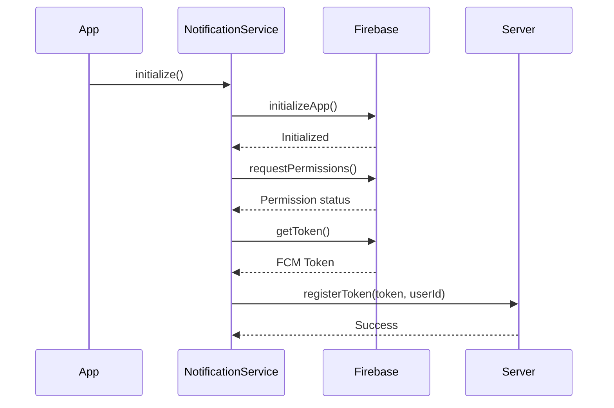

# Push Notifications in Zinzi

This document outlines the architecture, implementation, and flow of push notifications in the Zinzi application across all supported platforms: Android, iOS, macOS, and web.

## Overview

The push notification system is built using Firebase Cloud Messaging (FCM) and is fully centralized in the `NotificationService` class. The implementation provides a unified interface for all notification-related functionality while handling platform-specific requirements under the hood.

## Key Components

## Key Components

### 1. Centralized Notification Service (`lib/services/notification_service.dart`)

The `NotificationService` class is a singleton that provides a unified interface for all notification functionality:

#### Core Responsibilities:
- **FCM Token Management**
  - Token generation and refresh handling
  - Automatic token registration with the server
  - Token invalidation on logout

- **Message Handling**
  - Foreground message processing
  - Background message handling
  - Notification display in system tray
  - Data message processing

- **Platform Integration**
  - Handles platform-specific requirements
  - Manages notification channels (Android)
  - Handles APNs integration (iOS/macOS)
  - Manages service worker (Web)

- **Features**
  - Topic subscription management
  - Local notifications
  - Notification actions
  - Badge count management
  - Custom notification sounds

#### Initialization Flow:
1. Firebase initialization
2. Permission requests
3. FCM token retrieval
4. Message handler setup
5. Background handler registration

## Platform-Specific Implementation Details

### Android

#### Configuration (`android/app/src/main/AndroidManifest.xml`)
```xml
<!-- Required permissions -->
<uses-permission android:name="android.permission.INTERNET" />
<uses-permission android:name="android.permission.POST_NOTIFICATIONS" />
<uses-permission android:name="android.permission.VIBRATE" />
<uses-permission android:name="android.permission.RECEIVE_BOOT_COMPLETED"/>

<!-- Firebase services -->
<service
    android:name="io.flutter.plugins.firebase.messaging.FlutterFirebaseMessagingBackgroundService"
    android:exported="false"
    android:stopWithTask="false">
    <intent-filter>
        <action android:name="com.google.firebase.MESSAGING_EVENT" />
    </intent-filter>
</service>
```

#### Notification Channels
- Default channel for all notifications
- High priority channel for important alerts
- Silent channel for background updates

### iOS/macOS

#### Configuration (`ios/Runner/Info.plist` and `macos/Runner/Info.plist`)
```xml
<!-- Enable background modes -->
<key>UIBackgroundModes</key>
<array>
    <string>remote-notification</string>
    <string>fetch</string>
</array>

<!-- Notification capabilities -->
<key>FirebaseAppDelegateProxyEnabled</key>
<true/>
```

#### AppDelegate.swift
- Handles APNs token registration
- Manages notification permissions
- Forwards remote notifications to Flutter

### Web

#### Configuration (`web/index.html`)
```html
<!-- Firebase SDK -->
<script src="https://www.gstatic.com/firebasejs/9.0.0/firebase-app-compat.js"></script>
<script src="https://www.gstatic.com/firebasejs/9.0.0/firebase-messaging-compat.js"></script>
<script src="firebase-config.js"></script>
```

#### Service Worker (`web/firebase-messaging-sw.js`)
- Handles background messages
- Displays notifications when app is in background
- Manages click actions

## Notification Flow

### 1. Initialization


### 2. Receiving Notifications

#### Foreground
1. FCM delivers message to app
2. `onMessage` handler in `NotificationService` processes the message
3. Local notification is displayed using `flutter_local_notifications`
4. UI updates via `NotificationProvider`

#### Background (App in Background)
1. FCM delivers message to system
2. System displays notification
3. On tap, app opens and `onMessageOpenedApp` handler processes the message
4. Deep linking to relevant content

#### Terminated (App Not Running)
1. FCM delivers message to system
2. System displays notification
3. On tap, app launches
4. `getInitialMessage()` retrieves the message
5. Deep linking to relevant content

### 3. Platform-Specific Flows

#### Android
- Uses `FirebaseMessagingService` for background handling
- Notification channels for Android 8.0+
- High-priority notifications for time-sensitive content

#### iOS/macOS
- Uses APNs for delivery
- Requires proper provisioning profiles
- Handles silent notifications for background updates

#### Web
- Service worker for background handling
- Browser notification API for display
- Requires HTTPS for push notifications

## Setup Instructions

### Prerequisites

1. Firebase project with FCM enabled
2. Platform-specific configuration files:
   - `google-services.json` for Android
   - `GoogleService-Info.plist` for iOS/macOS
   - Web configuration in `firebase-config.js`

### Initialization

The notification service is initialized in `main.dart` during app startup:

```dart
void main() async {
  // ... other initialization code ...
  
  // Initialize Firebase
  await Firebase.initializeApp(
    options: DefaultFirebaseOptions.currentPlatform,
  );
  
  // Initialize Notification Service
  final notificationService = NotificationService();
  await notificationService.initialize();
  
  // Handle notification taps
  NotificationService.onNotificationTap = (data) {
    debugPrint('Notification tapped with data: $data');
    // Handle navigation based on notification data
  };
  
  // Get and log the FCM token
  final fcmToken = await notificationService.getFcmToken();
  if (fcmToken != null) {
    debugPrint('FCM Token: $fcmToken');
  }
  
  // ... rest of your app initialization ...
}
```

## Sending Notifications

### 1. From Backend Server

#### HTTP v1 API (Recommended)
```python
import requests
import json

def send_fcm_notification(access_token, fcm_token, title, body, data=None):
    url = 'https://fcm.googleapis.com/v1/projects/zinzi-fcm2/messages:send'
    
    headers = {
        'Authorization': f'Bearer {access_token}',
        'Content-Type': 'application/json; UTF-8',
    }
    
    message = {
        'message': {
            'token': fcm_token,
            'notification': {
                'title': title,
                'body': body
            },
            'data': data or {}
        }
    }
    
    response = requests.post(url, headers=headers, data=json.dumps(message))
    return response.json()
```

#### Legacy HTTP API
```bash
# Replace with your server key from Firebase Console > Project Settings > Cloud Messaging
SERVER_KEY="YOUR_SERVER_KEY"
FCM_TOKEN="DEVICE_FCM_TOKEN"

curl -X POST \
  https://fcm.googleapis.com/fcm/send \
  -H "Authorization: key=$SERVER_KEY" \
  -H "Content-Type: application/json" \
  -d '{
    "notification": {
      "title": "Test Notification",
      "body": "This is a test notification"
    },
    "to": "'$FCM_TOKEN'"
  }'
```

### 2. Using Firebase Console
1. Go to [Firebase Console](https://console.firebase.google.com/)
2. Select your project
3. Navigate to Engage > Cloud Messaging
4. Click "Create your first campaign"
5. Select "Firebase Notification messages"
6. Configure your notification and target audience

### 3. Testing with cURL

#### Simple Notification
```bash
curl -X POST \
  https://fcm.googleapis.com/fcm/send \
  -H "Authorization: key=YOUR_SERVER_KEY" \
  -H "Content-Type: application/json" \
  -d '{
    "to": "DEVICE_FCM_TOKEN",
    "notification": {
      "title": "Test Title",
      "body": "Test Body",
      "sound": "default"
    },
    "data": {
      "type": "order_update",
      "order_id": "12345",
      "status": "shipped"
    }
  }'
```

#### Silent Notification (Data-only)
```bash
curl -X POST \
  https://fcm.googleapis.com/fcm/send \
  -H "Authorization: key=YOUR_SERVER_KEY" \
  -H "Content-Type: application/json" \
  -d '{
    "to": "DEVICE_FCM_TOKEN",
    "priority": "high",
    "content_available": true,
    "data": {
      "type": "background_update",
      "timestamp": "2023-01-01T12:00:00Z",
      "data": "SOME_DATA"
    }
  }'
```
```

## Testing and Debugging

### Testing Checklist

#### All Platforms
- [ ] App in foreground
- [ ] App in background
- [ ] App terminated
- [ ] Multiple notifications
- [ ] Notification actions
- [ ] Deep linking
- [ ] Token refresh

#### Platform-Specific Tests

**Android**
- [ ] Different notification channels
- [ ] High-priority notifications
- [ ] Notification actions
- [ ] Do Not Disturb mode

**iOS/macOS**
- [ ] Permission prompts
- [ ] Silent notifications
- [ ] Notification actions
- [ ] Badge count updates

**Web**
- [ ] Different browsers (Chrome, Firefox, Safari)
- [ ] Service worker registration
- [ ] HTTPS requirement
- [ ] Browser permissions

### Common Issues and Solutions

#### Android
1. **Notifications not showing**
   - Verify `google-services.json` is in place
   - Check logcat for error messages
   - Ensure the app has notification permissions
   - Verify notification channel is created

2. **No sound/vibration**
   - Check notification channel settings
   - Verify sound file exists in `res/raw/`
   - Check Do Not Disturb settings

#### iOS/macOS
1. **Notifications not working**
   - Verify APNs certificates in Firebase Console
   - Check that push notifications are enabled in Xcode
   - Ensure proper provisioning profiles
   - Verify device token is being generated

2. **No badge updates**
   - Check app permissions
   - Verify badge count in notification payload
   - Check `content-available: 1` for background updates

#### Web
1. **Service Worker not registering**
   - Check browser console for errors
   - Verify service worker file exists at root
   - Ensure site is served over HTTPS

2. **No notifications**
   - Check browser notification permissions
   - Verify FCM token is generated
   - Check console for FCM errors

### Debugging Tools

#### Android
```bash
# Monitor logs
adb logcat -s Flutter

# Check notification channels
adb shell dumpsys notification --noredact

# List all installed packages
adb shell pm list packages | grep your.package.name
```

#### iOS
```bash
# Device logs
xcrun simctl spawn booted log stream --level=debug --predicate 'process == "Runner"'

# List installed apps
xcrun simctl listapps booted
```

#### Web
```javascript
// Check service worker registration
navigator.serviceWorker.getRegistrations().then(regs => {
  console.log('Service Workers:', regs);
});

// Check notification permission
console.log('Notification permission:', Notification.permission);
```

## Best Practices

### 1. Token Management
- **Secure Storage**: Store tokens securely on the server
- **Token Refresh**: Handle token refresh events
- **User Association**: Associate tokens with user accounts
- **Cleanup**: Remove invalid or outdated tokens

### 2. Notification Design
- **Clear Content**: Keep titles and messages concise
- **Relevant Actions**: Include appropriate actions
- **Deep Linking**: Link to relevant app content
- **Localization**: Support multiple languages

### 3. Performance
- **Batch Updates**: Group notifications when possible
- **Rate Limiting**: Avoid notification spam
- **Background Processing**: Offload work to background isolates

### 4. Security
- **HTTPS**: Always use HTTPS for API calls
- **Token Validation**: Validate FCM tokens
- **Sensitive Data**: Avoid sensitive data in notifications
- **Rate Limiting**: Implement server-side rate limiting

### 5. Testing
- **Automated Tests**: Test notification flows
- **Manual Testing**: Test on real devices
- **Edge Cases**: Test with poor network conditions
- **Platform-Specific**: Test all platform variations

## Advanced Topics

### 1. Notification Analytics
- Track delivery rates
- Monitor open rates
- Analyze user engagement

### 2. A/B Testing
- Test different notification content
- Measure conversion rates
- Optimize send times

### 3. Rate Limiting
- Implement server-side rate limiting
- Respect user preferences
- Handle edge cases

## Security Considerations

### 1. Data Protection
- Encrypt sensitive data
- Use secure connections
- Follow platform security guidelines

### 2. User Privacy
- Request permissions appropriately
- Provide opt-out options
- Follow platform privacy guidelines

### 3. Server Security
- Secure your FCM server key
- Implement proper authentication
- Monitor for abuse

## Monitoring and Maintenance

### 1. Error Tracking
- Monitor delivery failures
- Track token refresh issues
- Log notification errors

### 2. Performance Monitoring
- Track notification delivery times
- Monitor battery impact
- Measure app performance impact

### 3. Maintenance
- Keep dependencies updated
- Test with new OS versions
- Monitor for deprecations

## References

### Official Documentation
- [Firebase Cloud Messaging](https://firebase.google.com/docs/cloud-messaging)
- [FlutterFire Messaging](https://firebase.flutter.dev/docs/messaging/overview/)
- [FCM HTTP v1 API](https://firebase.google.com/docs/cloud-messaging/migrate-v1)

### Platform Guides
- [Android Notifications](https://developer.android.com/guide/topics/ui/notifiers/notifications)
- [iOS User Notifications](https://developer.apple.com/documentation/usernotifications)
- [Web Push API](https://developer.mozilla.org/en-US/docs/Web/API/Push_API)

### Best Practices
- [FCM Best Practices](https://firebase.google.com/docs/cloud-messaging/client/best-practices)
- [Notification Design Guidelines](https://material.io/design/platform-guidance/android-notifications.html)
- [Privacy Best Practices](https://developer.android.com/training/articles/user-data-ids)
